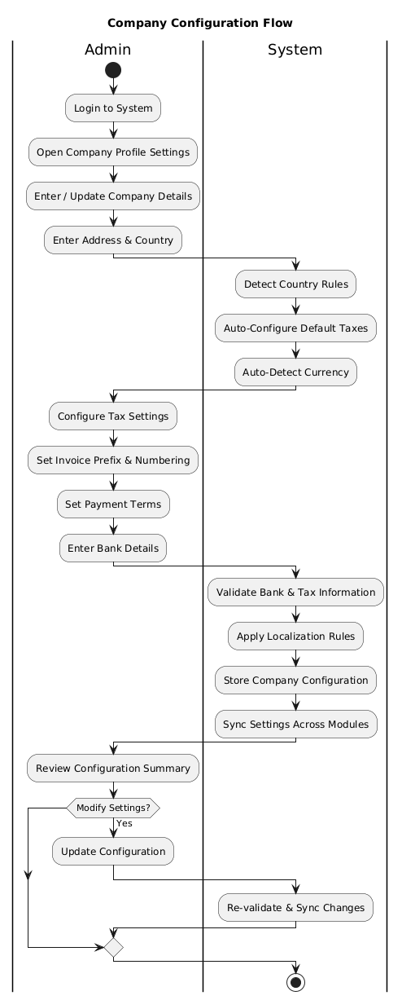
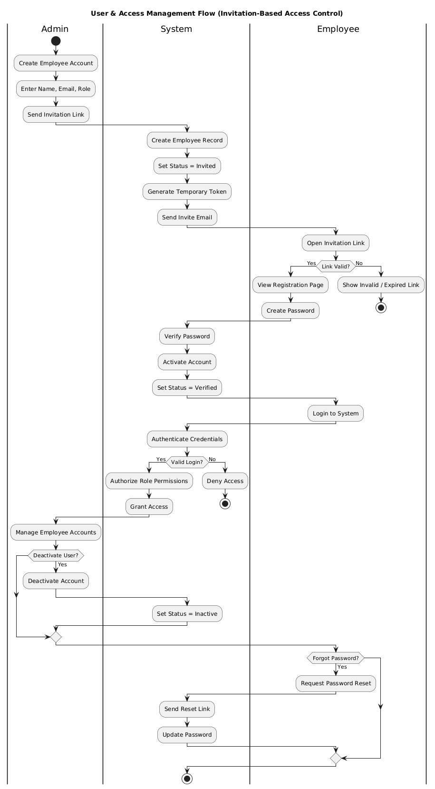
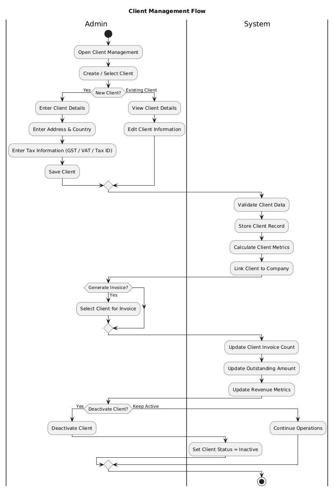
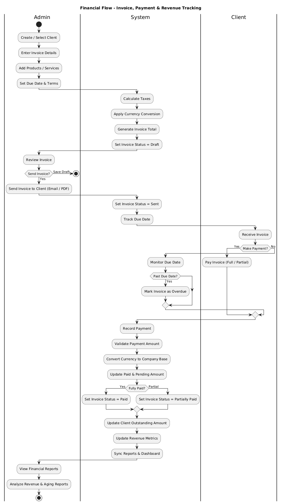
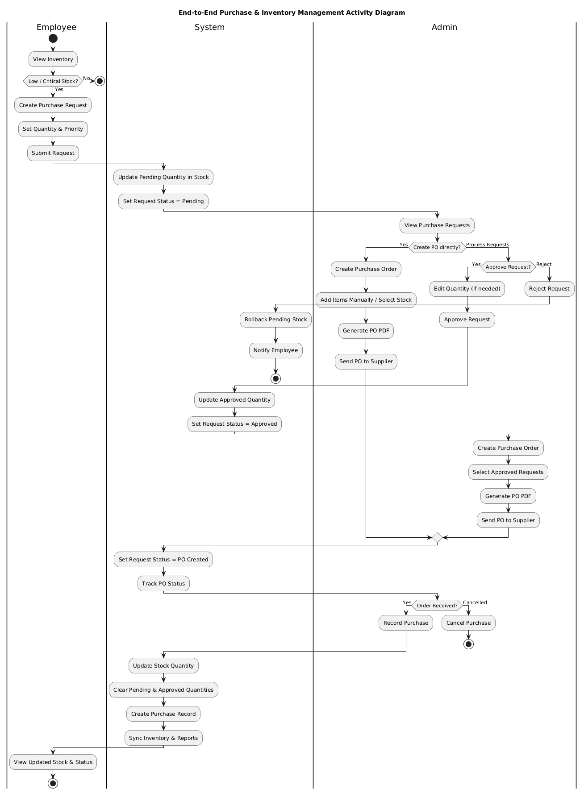
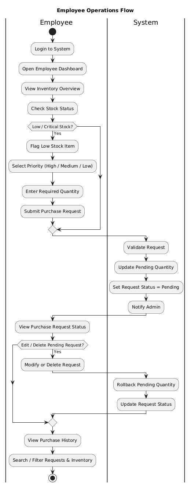

# Enterprise Resource Planning Software

A comprehensive business management platform built with modern web technologies. Manage invoices, inventory, purchases, clients, and suppliers with real-time data synchronization and multi-currency support.


## 🚀 Features

### Core Modules

#### 📊 Admin Dashboard
- **Real-time Financial Metrics**: Live calculation of revenue, pending amounts, and overdue tracking
- **Visual Analytics**: Interactive charts showing 6-month revenue trends and invoice status distribution
- **Top Clients Ranking**: Revenue-based client analysis with payment tracking
- **Recent Activities Feed**: Live updates from payments and invoices
- **Quick Actions**: Direct navigation to create invoices and manage clients
- **Multi-currency Display**: Consistent formatting based on company profile

#### 📄 Invoice Management
**Invoice List**
- Advanced multi-criteria filtering (number, client, status, dates)
- Real-time status calculation based on payments and due dates
- Professional PDF export with company branding
- Email integration for direct invoice delivery to clients
- Summary analytics with company currency formatting
- Bulk export capabilities

**Invoice Form**
- Three data sources: Manual products, Stock items, and Inventory items
- Smart tax calculation based on company/client locations
- Live currency conversion with real-time exchange rates (INR base)
- Stock integration with automatic quantity validation and deduction
- Product auto-completion with searchable dropdowns

#### 👥 Client Management
- International support with multi-country tax information (GSTIN, VAT, Tax ID)
- Real-time client metrics: invoice count, revenue, outstanding amounts
- Complete contact and address management
- Multi-field search including tax IDs
- Active/inactive status tracking

#### 💳 Payment Management
- Multi-method tracking: Cash, Bank Transfer, UPI, and Card payments
- Partial payment handling with automatic balance adjustments
- Real-time synchronization with invoice status
- Advanced filtering by status, method, client, and date ranges
- CSV export for reconciliation and reporting
- Payment validation against invoice totals
- Accurate currency handling with proper conversion

#### 🏢 Supplier Management
- International tax handling (GSTIN, VAT, Tax ID)
- Real-time metrics: purchase count, total spend, outstanding payables
- Complete contact management (email, phone, physical address)
- Multi-field search across supplier details
- Active/inactive status tracking with audit history

#### 👨‍💼 Employee Management
- Role-based access control with invitation-based onboarding
- Secure authentication with temporary passwords and password reset workflows
- Real-time tracking of employee lifecycle states
- Company/department association via companyId
- Multi-field search by name, email, role, country, or status
- Complete CRUD operations with audit logs for compliance

#### ⚙️ Company Profile
- International company setup with country-specific fields
- Automatic tax configuration based on company country
- Invoice customization: prefix settings, numbering, payment terms
- Country-specific banking information (SWIFT, IBAN, etc.)
- Automatic currency detection and conversion setup

#### 📈 Reports & Analytics
**Revenue Analysis**
- Total revenue from paid invoices
- Invoice count and average invoice value
- Active clients tracking
- Monthly revenue trends (bar chart)
- Invoice count trends (line chart)

**Client Reports**
- Top client performance reports
- Client-level payment insights
- Revenue and outstanding balance analysis

**Aging Reports**
- Outstanding invoices by aging buckets (0–30, 31–60, 61–90, 90+ days)
- Aging summary with counts and values
- Visual charts for overdue invoice monitoring

### Purchase Management Module

#### 📝 Purchase Requests (Employee Side)
- Inventory status view with low stock flagging
- Priority-based request system (high/medium/low)
- Real-time status tracking (Pending → Approved → PO Created → Order Recorded)
- Request deletion with automatic stock rollback
- Multi-field search and filtering

#### ✅ Purchase Requests (Admin Side)
- Comprehensive request management with approve/reject actions
- Inline quantity editing with real-time stock synchronization
- Status progression tracking with visual indicators
- Chat history modal for admin-employee communication
- Summary cards for total, pending, approved, and critical stock requests

#### 📋 Purchase Order Management
- Professional PO creation from approved purchase requests
- Multi-currency support with automatic conversion
- PDF generation with comprehensive supplier/company details
- Real-time PO tracking and status management
- Tax calculations based on company/supplier countries

#### 📦 Purchase Recording
- Complete purchase history tracking
- Multi-item purchase support with detailed breakdowns
- Currency conversion tracking with exchange rates
- PDF export functionality
- Status management (completed/pending/cancelled)
- Supplier relationship tracking

### Inventory Management

#### 🏷️ Product Management (Admin)
- Product definitions with categories, names, and versions
- Rate management with multi-currency support
- Duplicate prevention based on product attributes
- Category, name, and version CRUD operations
- Active/inactive product status

#### 📊 Stock Details Management
- Real-time stock tracking with current quantities
- Stock status calculation (normal/low/critical) based on thresholds
- Purchase request integration tracking
- Min/max threshold management for reorder points
- Display status control for employee visibility

### Employee Modules

#### 🖥️ Employee Dashboard
- Real-time inventory overview with stock status indicators
- Personal purchase request tracking
- Company-wide purchase history visibility
- Summary cards for total items, low stock, critical stock
- Search and filtering capabilities with pagination

#### 📦 Employee Inventory View
- Comprehensive stock visibility with real-time updates
- Flag Low Stock functionality with priority selection
- Purchase request creation with auto-filled product details
- Stock status filtering
- Request deletion with stock rollback

#### 🛒 Employee Purchase Management
- Personal request tracking with status progression
- Purchase history visibility
- Search and filtering across requests and history
- Status badges with clear visual indicators
- Detailed purchase information modals

## 🏗️ Architecture & System Design

### System Workflows

#### Company Configuration Flow
Complete setup process for company profile, tax settings, and localization.



#### User Access Management Flow
Invitation-based employee onboarding with role-based access control.



#### Client Management Flow
End-to-end client lifecycle from registration to invoice generation.



#### Supplier Management Flow
Supplier registration, validation, and purchase order integration.


#### Financial Flow
Complete invoice creation, payment tracking, and revenue management workflow.



#### Inventory & Purchase Flow
End-to-end purchase management from employee request to stock update.



#### Employee Operations Flow
Employee dashboard, inventory viewing, and purchase request submission.



#### Reporting & Analytics Flow
Comprehensive reporting system with multiple report types and data visualization.


## 🛠️ Technology Stack

### Frontend
- **React.js** - UI library
- **React Router** - Navigation
- **Material-UI / Custom CSS** - Styling and components

### Backend & Database
- **Firebase Authentication** - User management and security
- **Cloud Firestore** - Real-time NoSQL database
- **Firebase Storage** - File storage for documents and images

### APIs & Integrations
- **Currency Exchange API** - Real-time exchange rate conversion
- **PDF Generation Library** - Professional document creation
- **Email Service Integration** - Invoice and PO delivery

## 📁 Database Structure

### Core Collections

#### `companies`
Primary business entity with company configuration
- Business information, tax details, banking info
- Currency and localization settings
- Invoice customization preferences

#### `employees`
User management and access control
- Identity and contact information
- Role-based permissions
- Company association and verification status

#### `inventory`
Master product catalog with pricing
- Product categories, names, and versions
- Multi-currency pricing
- Stock quantity management

#### `stock_details`
Real-time inventory tracking
- Current stock levels and status
- Min/max thresholds
- Purchase request integration

#### `purchase_requests`
Employee-initiated stock requests
- Request details and priority
- Status tracking
- Stock context and pricing

#### `purchase_orders`
Formal purchase documents
- Supplier information
- Item details and quantities
- Financial calculations and tax

#### `purchase_records`
Historical purchase tracking
- Completed purchase details
- Currency conversion records
- Expense tracking

#### `suppliers`
Vendor management
- Contact and business information
- Tax details for international suppliers
- Purchase metrics and outstanding amounts

#### `clients`
Customer management
- Contact and address information
- Tax identification details
- Invoice and payment metrics

#### `invoices`
Revenue management
- Invoice details and line items
- Multi-currency amounts
- Payment tracking and status

#### `payments`
Payment processing
- Payment method tracking
- Partial payment support
- Currency conversion records

## 🔄 System Workflows

### Purchase Flow
```
Employee → Purchase Request → Stock Update → 
Admin Approval → Purchase Order → Purchase Record → 
Final Stock Update
```

### Inventory Flow
```
Inventory Definitions ↔ Stock Details → 
Employee Visibility → Purchase Requests
```

### Financial Flow
```
Clients → Invoices → Payments → Financial Reports
Suppliers → Purchase Orders → Purchase Records
```

## 🚦 Getting Started

### Prerequisites
- Node.js (v14 or higher)
- npm or yarn
- Firebase account
- Currency exchange API key

### Installation

1. **Clone the repository**
   ```bash
   git clone https://github.com/yourusername/erp-updated.git
   cd erp-updated
   ```

2. **Install dependencies**
   ```bash
   npm install
   ```

3. **Configure Firebase**
   - Create a Firebase project at [Firebase Console](https://console.firebase.google.com/)
   - Enable Authentication, Firestore, and Storage
   - Copy your Firebase configuration

4. **Set up environment variables**
   Create a `.env` file in the root directory:
   ```env
   REACT_APP_FIREBASE_API_KEY=your_api_key
   REACT_APP_FIREBASE_AUTH_DOMAIN=your_auth_domain
   REACT_APP_FIREBASE_PROJECT_ID=your_project_id
   REACT_APP_FIREBASE_STORAGE_BUCKET=your_storage_bucket
   REACT_APP_FIREBASE_MESSAGING_SENDER_ID=your_sender_id
   REACT_APP_FIREBASE_APP_ID=your_app_id
   REACT_APP_CURRENCY_API_KEY=your_currency_api_key
   ```

5. **Initialize Firestore Security Rules**
   Deploy the security rules from `firestore.rules`:
   ```bash
   firebase deploy --only firestore:rules
   ```

6. **Start the development server**
   ```bash
   npm run dev
   ```

   The application will open at `http://localhost:8081`

## 🔐 Security Features

- **Role-based Access Control**: Separate admin and employee interfaces
- **Secure Authentication**: Firebase Authentication with password reset
- **Data Isolation**: Multi-tenancy via companyId
- **Audit Trails**: Complete transaction history
- **Input Validation**: Comprehensive validation across all forms
- **Firestore Security Rules**: Database-level access control

## 📱 User Roles

### Admin
- Full system access
- Invoice and payment management
- Client and supplier management
- Purchase request approval
- Purchase order creation
- Reports and analytics
- Employee management

### Employee
- Inventory visibility
- Purchase request creation
- Personal request tracking
- Purchase history viewing
- Stock status monitoring

## 🎨 Key Features

✅ **Real-time Data Synchronization** - Firestore listeners for live updates  
✅ **Multi-currency Support** - Automatic conversion with rate tracking  
✅ **Multi-country Tax Support** - GSTIN, VAT, Tax ID for various countries  
✅ **Professional Document Generation** - PDF invoices and purchase orders  
✅ **Email Integration** - Automated invoice and PO delivery  
✅ **Responsive Design** - Works on desktop, tablet, and mobile  
✅ **Search & Filtering** - Advanced search across all modules  
✅ **Export Capabilities** - CSV and PDF exports for reporting  
✅ **Status Tracking** - Visual indicators throughout workflows  
✅ **Partial Payments** - Flexible payment recording  

## 📊 Analytics & Reporting

- Revenue trends and forecasting
- Client performance analysis
- Aging reports for receivables
- Inventory turnover tracking
- Purchase analytics
- Payment collection metrics

## 🤝 Contributing

Contributions are welcome! Please follow these steps:

1. Fork the repository
2. Create a feature branch (`git checkout -b feature/AmazingFeature`)
3. Commit your changes (`git commit -m 'Add some AmazingFeature'`)
4. Push to the branch (`git push origin feature/AmazingFeature`)
5. Open a Pull Request

## 📝 License

This project is licensed under the MIT License - see the [LICENSE](LICENSE) file for details.

## 👨‍💻 Author

Mahesh P Pai
 
GitHub: https://github.com/MAHESHPPAI
Project Link: https://github.com/MAHESHPPAI/erp-updated

## 🙏 Acknowledgments

- Firebase for backend infrastructure
- React community for excellent tools and libraries
- Currency exchange API providers
- All contributors and testers

## 📧 Support

For support, email support@yourcompany.com or create an issue in the repository.
